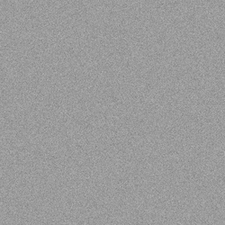

# RNG-Cracker
A collection of pseudo-random number generator (PRNG) implementations and tools for analysis, testing, and state recovery experiments.
 

This project includes multiple RNG algorithms such as LCG, SplitMix64, Xoroshiro, PCG, SFC64, WyRand, and more. The goal is to provide a hands-on toolkit for learning about PRNG design, evaluating randomness, and exploring vulnerabilities.

- **Multiple PRNG implementations**
  - LCG
  - SplitMix64
  - Xoroshiro128+
  - Xoroshiro128**
  - Xoroshiro256++
  - Xoshiro256**
  - Xoshiro512++
  - PCG32
  - SFC64
  - WyRand

- **State recovery / cracking experiments**
  - Demonstrates how PRNG outputs can be analyzed to recover seeds or internal state.
